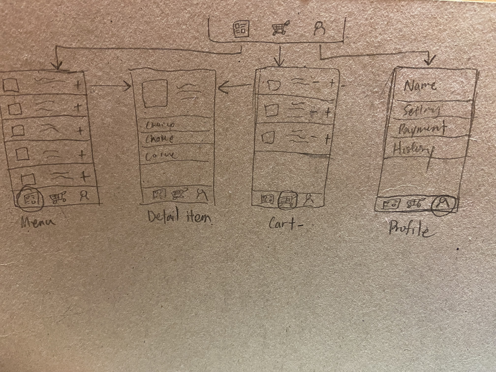

===

## Hangry Joe

## Table of Contents

1. [Overview](#Overview)
2. [Product Spec](#Product-Spec)
3. [Wireframes](#Wireframes)
4. [Schema](#Schema)

## Overview
#1

#2

### Description

Hangry Joe’s is a fried chicken restuarnt where people order food. This app could allow people to order food online and get notices of coupons. Earn points for rewards and navaigate menu.

### App Evaluation

- **Mobile**: Having a Mobile version will enchance user experiences because customers would be able to recieve real time notification on when their order is ready. There can also be maps to show user closest store location.
- **Story**: I am currently working at Hangry as a part-time and many customers ask if we have an app or some sort that they can keep track of their order or earn points etc. I think if there is something like that it would make ordering easier.
- **Market**: This app have a pretty large market since anyone can order food online. Hangry Joe is a fried chicken restuarant so anyone who is interest could possibly be the audience,
- **Habit**: Users would only comsume from this app since its main purpose is to take orders. It could develope habits for user if they order from here often, but it is not addictive in a way that a person would open this app everyday.
- **Scope**: It is challenging to complete the app within a short amount of time, but I think basic features can be implemented without much complication.

## Product Spec

### 1. User Stories (Required and Optional)

**Required Must-have Stories** (new user stories added)

- [✓] Users are able to view menu
- [✓] Users can navigate to cart screen
- [✓] Users can navigate to profile screen
- [✓] Users acn add items to cart
- [✓] Users can delete items in cart

**Optional Nice-to-have Stories**

- [ ] Users earn points per order
- [ ] Users can look for locations of restaurant
- [ ] Users can add comments for each item on the menu

### 2. Screen Archetypes

- Menu Screen
  *[✓] users can browse items
  *[✓] users can select items
- Shopping cart Screen
  *[✓] users can browse their cart
  *[✓] users can delete items from cart

### 3. Navigation

**Tab Navigation** (Tab to Screen)

* Menu
* Cart
* Profile (for future reference)

**Flow Navigation** (Screen to Screen)

- Menu
  * detail item screen
- Cart
  * detail item screen

## Wireframes

### [BONUS] Digital Wireframes & Mockups

### [BONUS] Interactive Prototype

## Schema 

Run within Xcode

### Models

[Add table of models]

### Networking

- [Add list of network requests by screen ]
- [Create basic snippets for each Parse network request]
- [OPTIONAL: List endpoints if using existing API such as Yelp]
